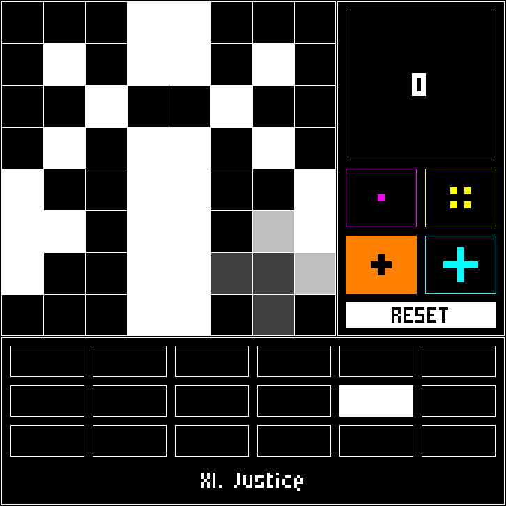

# Dolm

A Lights Out like puzzle game.

The objective is to turn every tile dark using the minimum posible steps, for this you have different shapes that swap the state of each tile they contain.

There are 17 levels. Levels vary greatly in difficulty but they can all be solved without using the dot shape (magenta button).

Good luck.



## Run

```
git clone git@github.com:DCCXXV/dolm.git
cd dolm
dune exec dolm
```
